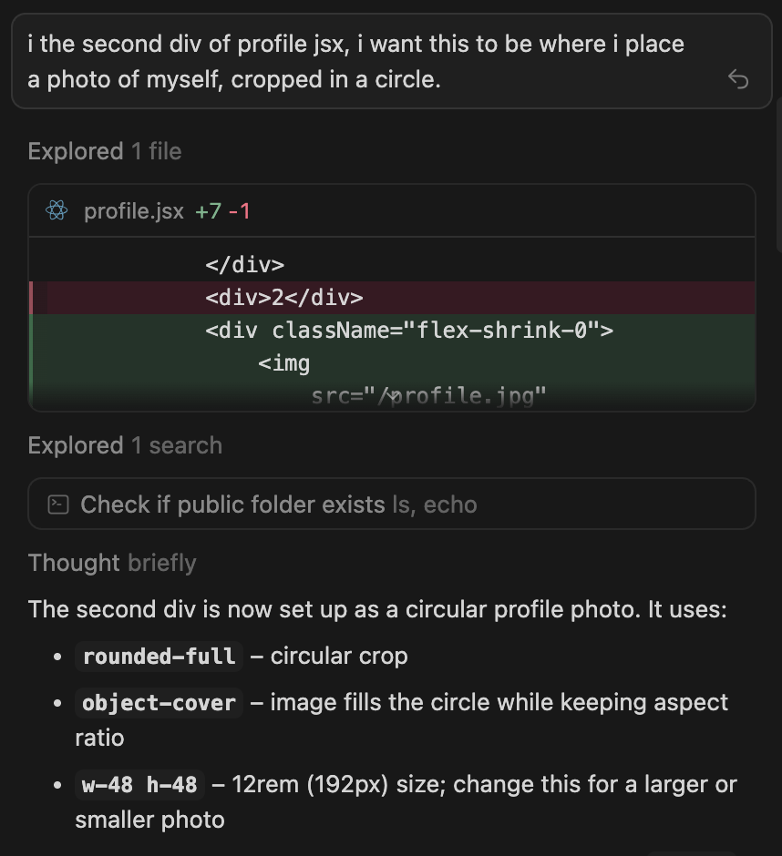
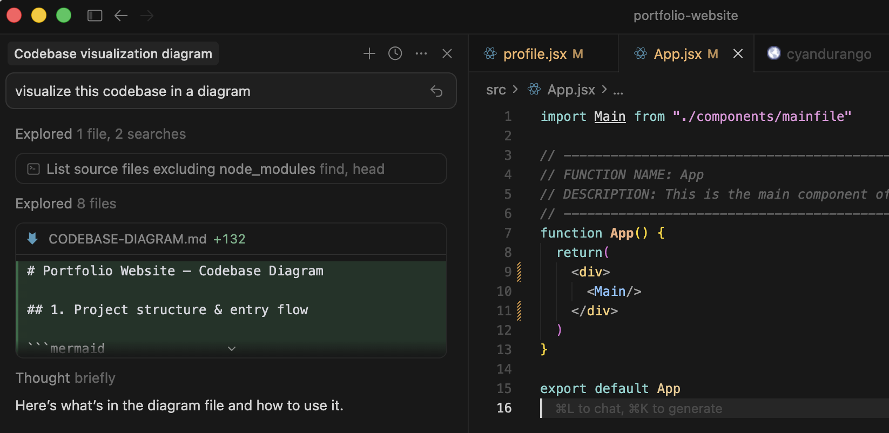
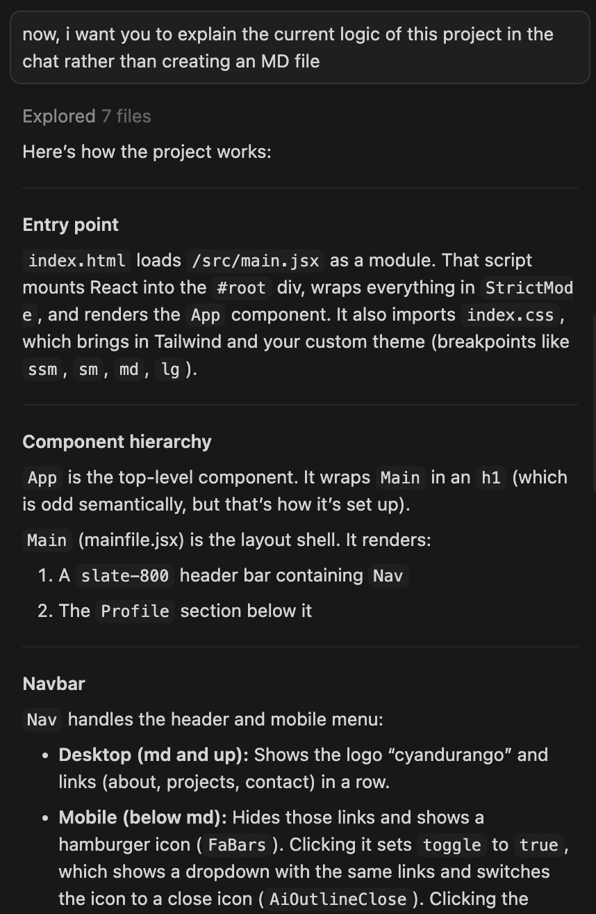

# 2.2 Learning AI Coding Tools (Cursor, Claude Code, Windsurf, Anti Gravity)
Goal: Learn how to use modern AI-assisted development tools responsibly and effectively in real development workflows.

## **_Which tool did you use?_**
I installed Cursor.

## **_What did you use it for?_**
I used the AI tool to do the following: 
* 

generate [code](assets/cursor-code-gen.png) for adding the picture to my ongoing personal project

* 

visualize the [codebase](assets/cursor-codebase-diagram.png) of the same personal project

* 

explain its overall [logic](assets/cursor-code-logic.png), and the things need to be improved in this project

## **_What did it help and struggle with_**
Cursor helped me understand what is needed more for this project, and what can be improved upon its structure and convention. It strugged, however, on generic prompts and prefers more specific messages for better outputs (as is with all AI tools).

